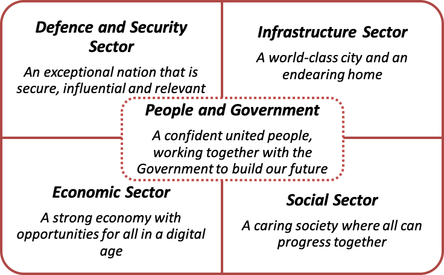

# Core National Education Content

The aim of the core National Education (NE) content project is to identify and develop a set of common core NE content which is quintessentially Singaporean, and set the basis of what Singaporeans need to know and understand about Singapore. 

**Framework for Core NE Content**

